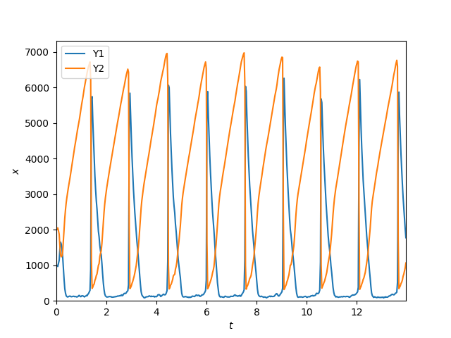

# SSM

Stochastic simulation methods.

## Installation

SSM requires c++20.

```shell
git clone https://github.com/amlucas/SSM.git --recursive
cd SSM
mkdir build
cd build
cmake ..
make -j
make test
```

## Running a simulation

Simulations are described in a json file (see the `examples` directory).
They are composed of a solver (e.g. the SSA algorithm), a list of reactions, the initial conditions, and extra parameters such as the number of runs and the simulation time.
In addition, diagnostics can be attached to the simulation to information.

Running and plotting the results of the Brusselator example:
```shell
./build/apps/run_simulation examples/brusselator.json
./tools/plot_mean_trajectories.py brusselator.csv --show-only Y1 Y2
```



## Reaction syntax

Reactions are fully described by a rate and a string that describe the reactant and product names as well as their stoichiometric coefficients.

Example of valid reactions:
```json
{
    "reactions": [
        {"rate": 0.1, "reaction": "[X1] -> Y1"},
        {"rate": 0.1, "reaction": "[X2] + Y1 -> Y2 + Z1"},
        {"rate": 0.00005, "reaction": "2 Y1 + Y2 -> 3 Y1"},
        {"rate": 5, "reaction": "Y1 -> Z2"}
    ]
}
```

The brackets (e.g. in `[X1]`) indicate that the species is a reservoir.
During the simulation the quantity of the species `[X1]` will not change.


## Structure of this repository

* apps: source code for standalone executables.
* source: source code of the SSM library.
* examples: example json file of stochastic simulations.
* extern: external dependencies required by the SSM library.
* tests: unit tests for the SSM library.
* tools: additional helper tools for e.g. plotting the results of a simulation.
